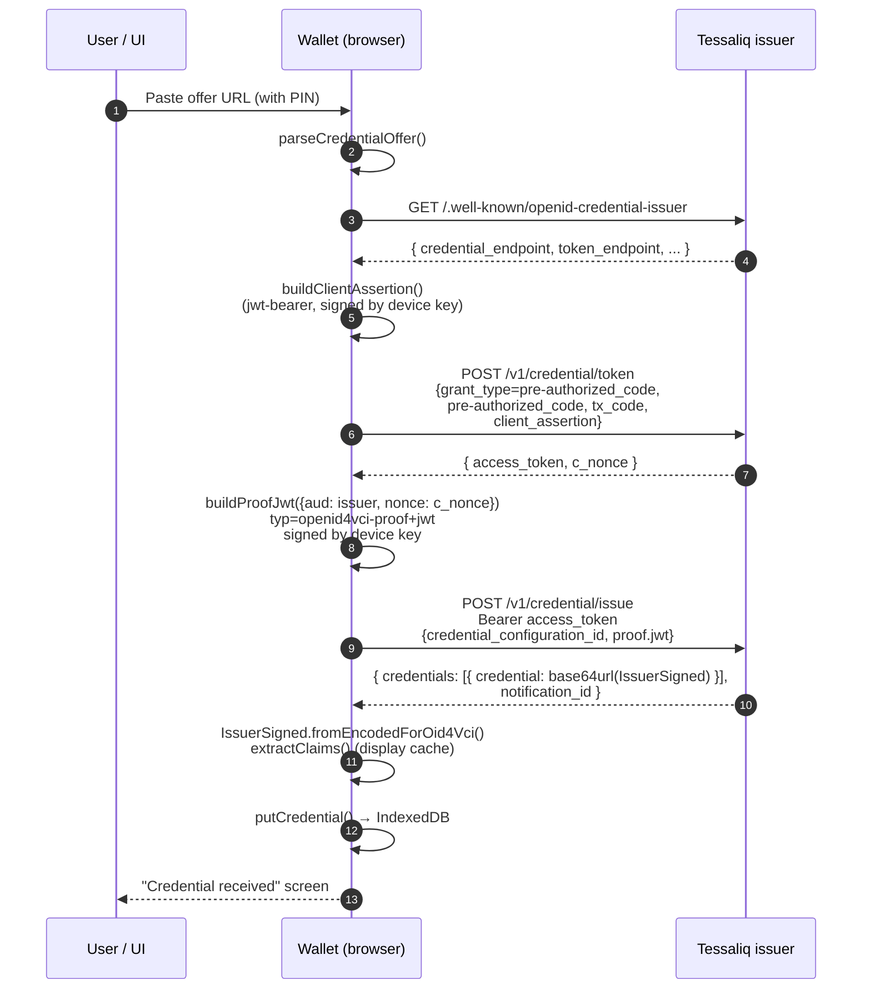
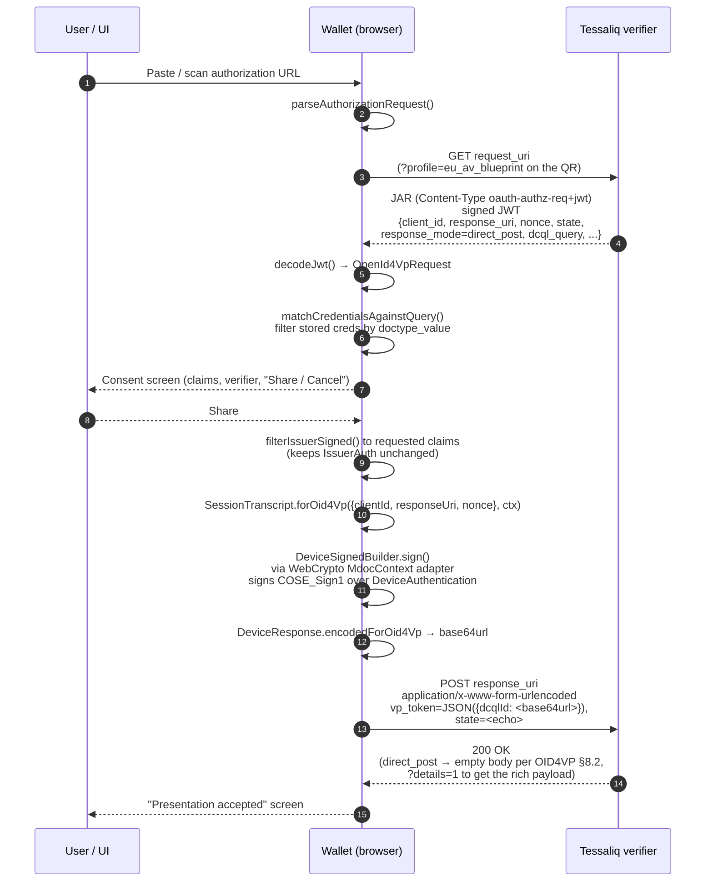

# Protocol flows

Two flows, both initiated by a URL the user scans or pastes.

## 1. OID4VCI — receive a credential

The user has a credential offer URL of the form
`openid-credential-offer://?credential_offer=…`. The offer points at the
Tessaliq issuer and includes a pre-authorized code plus a `tx_code`
(numeric PIN, 4 digits in staging).



### What the wallet signs

Two JWTs flow over the wire from the wallet to the issuer:

| JWT | Where | Header | Payload | Key |
|-----|-------|--------|---------|-----|
| **client_assertion** | token endpoint body | `alg=ES256`, `typ=JWT`, `jwk=<device public JWK>` | `iss = sub = thumbprint`, `aud = [issuer URL, token endpoint]`, `iat`, `exp = +5m`, `jti = uuid` | device private key |
| **proof.jwt** | credential endpoint body, inside `proof.jwt` | `alg=ES256`, `typ=openid4vci-proof+jwt`, `jwk=<device public JWK>` | `aud = issuer URL`, `iat`, `nonce = c_nonce` (from token response) | device private key |

Both are signed via `jose` against the WebCrypto private key.

### What the issuer returns

`IssuerSigned` CBOR, base64url-encoded. Structure:

```
IssuerSigned
├── issuerNameSpaces { "eu.europa.ec.av.1": [
│     IssuerSignedItem { elementIdentifier: "age_over_18", elementValue: true,
│                         random: <bytes>, digestID: 0 },
│     IssuerSignedItem { elementIdentifier: "age_over_21", elementValue: true, ... },
│     ...
│   ]}
└── issuerAuth (COSE_Sign1)
    ├── protectedHeaders { alg: ES256 | ES384 }
    ├── unprotectedHeaders { x5chain: <DSC + chain> }
    ├── payload: MobileSecurityObject (CBOR)
    │     ├── docType: "eu.europa.ec.av.1"
    │     ├── valueDigests: { "eu.europa.ec.av.1": { 0: <hash>, 1: <hash>, ... } }
    │     ├── deviceKeyInfo.deviceKey: <wallet public key, from proof.jwt jwk>
    │     ├── validityInfo { signed, validFrom, validUntil }
    │     └── digestAlgorithm: "SHA-256"
    └── signature: issuer DSC signature over the payload
```

The wallet stores the encoded bytes verbatim. The `claims` field stored
alongside is a display cache (`getPrettyClaims()` from `@owf/mdoc`).

## 2. OID4VP — present a credential

The user has an OID4VP authorization URL. For the EU AV blueprint profile
it begins with `av://authorize?…`; standard requests begin with
`openid4vp://authorize?…`. In both cases the parameter is `request_uri=…`
pointing at the verifier's JAR endpoint.



### What the verifier sees and checks

The wallet sends a single form parameter `vp_token` containing a JSON
object keyed by the DCQL credential id, mapping to the base64url-encoded
`DeviceResponse` CBOR. The verifier then runs `Verifier.verifyDeviceResponse`
from `@owf/mdoc`, which performs:

| Check | What it verifies |
|-------|------------------|
| Issuer signature | `issuerAuth` (COSE_Sign1) over the MSO is valid, signed by a DSC whose chain terminates at a trusted IACA root (in staging the dev verifier disables chain validation) |
| MSO validity | `signed` is in the past, `validFrom` ≤ now ≤ `validUntil`, all within DSC validity period |
| Digest match | Each disclosed `IssuerSignedItem` hashes (per `digestAlgorithm`) to the matching `digestID` entry in `valueDigests` — this is the selective-disclosure binding |
| Device key match | `deviceSigned.deviceAuth.deviceSignature` verifies against the public key in `MSO.deviceKeyInfo.deviceKey` |
| SessionTranscript | The signed payload (`DeviceAuthentication` CBOR) embeds a `SessionTranscript` whose `OpenID4VPHandover` hash is computed from `(clientId, responseUri, nonce, jwkThumbprint?)`. The verifier rebuilds it from its own state and matches byte-for-byte |

### The `SessionTranscript` binding

The most subtle part of the flow. The wallet and verifier MUST compute the
same `SessionTranscript` or the device signature check fails.

`SessionTranscript.forOid4Vp` builds a CBOR structure containing:

```
[null, null, OpenID4VPHandover]
   │      │           │
   │      │           └─ ["OpenID4VPHandover", SHA-256(OpenID4VPHandoverInfo)]
   │      │                                    │
   │      │                                    └─ CBOR([clientId, nonce, jwkThumbprint|null, responseUri])
   │      │
   │      └─ eReaderKey (null for OID4VP)
   │
   └─ deviceEngagement (null for OID4VP)
```

For `direct_post` (no encryption), `jwkThumbprint` is **absent** from the
`OpenID4VPHandoverInfo` options. For `direct_post.jwt` / `dc_api.jwt`,
`jwkThumbprint` is the SHA-256 of the verifier's ephemeral encryption JWK.

If the wallet computes the transcript with `jwkThumbprint = undefined`
and the verifier computes it with the thumbprint present (or vice versa),
the 32-byte `OpenID4VPHandover` hash diverges and DeviceAuth fails. This
is the exact bug that was [tessaliq#234](https://github.com/oliviermeunier/tessaliq/issues/234)
— see [DEBUGGING.md](./DEBUGGING.md#deviceauth-mismatches).

### `DeviceAuthentication` — what the device key actually signs

`DeviceAuthentication` is the CBOR-tagged payload signed by the device
private key. Structure:

```
DeviceAuthentication (CBOR tag 24, "DeviceAuthentication")
├── "DeviceAuthentication"
├── sessionTranscript (from above)
├── docType (string, e.g. "eu.europa.ec.av.1")
└── deviceNamespaces (empty CBOR map in V1 — all attributes are issuer-signed)
```

The signature is a COSE_Sign1 with:

- `protectedHeaders`: `{ alg: ES256 }`
- `unprotectedHeaders`: `{ x5chain: <wallet self-signed DER cert> }`
- `payload`: null (detached) — the verifier reconstructs `DeviceAuthentication`
  bytes on its side and feeds them as the detached payload before verifying
- `signature`: ECDSA P-256 over `Sign1.toBeSigned`

The verifier does **not** trust the `x5chain` for authentication — trust
comes from `MSO.deviceKeyInfo.deviceKey` which the issuer signed at
credential issuance time, and the device proves possession by signing
`DeviceAuthentication` with the matching private key.

## Profile lockdown: `?profile=eu_av_blueprint`

When the verifier emits the JAR with `?profile=eu_av_blueprint` in the
`request_uri`, several normalisations apply (per the EU AV blueprint
annexe A §A.6):

| Default | Locked down to |
|---------|----------------|
| `response_mode: direct_post.jwt` | `direct_post` (no encryption) |
| `client_id: x509_hash:<base64url(sha256(der_leaf))>` or `x509_san_dns:<host>` | `redirect_uri:<response_uri>` |
| `trusted_authorities: [aki: [...]]` | omitted (TLS/Web PKI trust per spec) |
| `openid4vp://` deep link | `av://` deep link |
| JAR fetched via `request_uri` | JAR may be embedded inline in the QR (`request=`) for offline scans |

The wallet does not need to know about these — it just reads what the JAR
says and acts on it. But it explains why the same `eu.europa.ec.av.1`
credential can be presented to two verifiers with very different
`client_id` shapes and SessionTranscripts.
